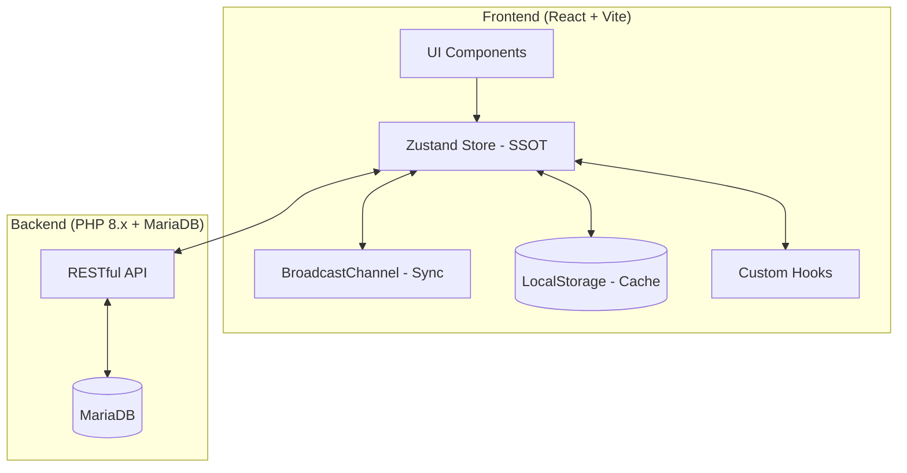

# KECLC (KEC Calculation Suite) 시스템 마스터 설계서

이 문서는 KECLC 프로젝트의 설계 철학, 시스템 아키텍처, 데이터 흐름, 계산 로직 및 DB 구조를 상세히 정의한 단일 마스터 청사진입니다. 새로운 개발자나 AI 에이전트가 시스템의 모든 동작 원리를 오해 없이 100% 이해할 수 있도록 기술되었습니다.

---

## 1. System Architecture Overview (시스템 개요 및 아키텍처)

### 1.1 시스템 아키텍처 다이어그램

### 1.2 기술 스택 및 버전
- **Frontend**: React 18, Vite, Zustand (상태 관리), Tailwind CSS (스타일), Lucide React (아이콘)
- **Backend**: PHP 8.x (REST API)
- **Database**: MariaDB 10.x
- **Communication**: BroadcastChannel API (탭 간 동기화), Fetch API (서버 통신)

### 1.3 핵심 설계 철학
- **Memory-First Architecture**: 모든 데이터의 기준(SSOT)은 메모리(Zustand)에 있으며, UI는 오직 메모리 상태를 구독하여 렌더링한다.
- **Zero-Sync (Deterministic State)**: 탭 간 동기화 시 타임스탬프 기반의 모호한 비교가 아닌, 명시적인 상태 플래그와 전파 신호를 통해 데이터 유실 없는 확정적 동기화를 달성한다.
- **Local-First Data Flow**: 데이터 변경 시 `Store -> LocalStorage` 순으로 즉시 반영하여 네트워크 지연이나 브라우저 종료 시에도 데이터 손실을 방지한다.
- **Bi-directional Reactivity**: 부모-자식 계산서 간의 데이터가 실시간으로 상호 전파되며, 변경 사항이 발생하면 연쇄적으로 계산 결과가 갱신된다.

---

## 2. Core State Management & Synchronization (핵심 상태 관리 및 동기화)

### 2.1 Zustand Store 구조와 역할 (`useDataStore.js`)
- `panels`: 모든 계산서의 원시 입력 데이터 (JSON).
- `results`: 각 계산서의 최종 계산 결과 (부하량, 차단기 선정 등).
- `syncStatus`: `local` (idle/saved) 및 `remote` (idle/saving/saved/error) 상태를 추적하여 UI 인디케이터에 반영.
- `TAB_ID`: 탭마다 생성되는 고유 ID로, 내가 보낸 브로드캐스트 메시지를 스스로 수신하지 않도록 필터링한다.

### 2.2 BroadcastChannel 실시간 동기화
- **채널명**: `KECLC_STATE_SYNC`
- **메커니즘**: 한 탭에서 데이터 수정 시 `UPDATE_PANEL` 메시지를 전파. 타 탭은 이를 수신하여 자신의 Store를 갱신하고 `kelc_connections_changed` 이벤트를 발생시켜 UI를 리렌더링한다.
- **Echo 방지**: `if (senderId === TAB_ID) return;` 가드를 통해 무한 핑퐁 루프를 원천 차단한다.

### 2.3 데이터 저장 3단계 지시자 시스템
1. **DIRTY (Draft)**: 메모리에만 존재하거나 서버에 'Draft' 키로 저장된 상태. 아직 최종 '저장' 버튼을 누르지 않은 임시 변경 상태.
2. **LOCAL_SAVED**: LocalStorage에 `kelc_panel_cache_${panelId}`로 저장된 상태. 브라우저를 닫아도 복구 가능하다.
3. **SERVER_SYNCED (Origin)**: 서버의 정규 데이터베이스(`panel_data` 테이블)에 영구 저장된 상태.

### 2.4 무한 Echo 방지 및 useEffect 동기화 로직
- **`isLocalChangeRef` 가드**: 
    - 사용자가 직접 UI를 조작할 때만 `true`로 설정.
    - 외부(타 탭)에서 온 데이터로 상태를 업데이트할 때는 `false` 유지.
    - `useEffect` 내에서 `isLocalChangeRef.current`가 `true`일 때만 브로드캐스트 및 서버 저장을 실행하여 자동 동기화 루프를 방지한다.
- **Debounce(디바운스)**: 입력 시마다 서버에 요청하지 않고, 약 2~3초간 입력이 멈추면 자동으로 Draft를 서버에 저장한다.
- **SSOT (Single Source of Truth) 확장:** `panelsData`뿐만 아니라 계통도(`panelConnections`) 정보 역시 스토어의 핵심이며, 모든 변경 사항은 즉시 브로드캐스트 되어야 한다.
- **Sync-Before-Broadcast (선행 DB 동기화 원칙):** 계통의 호적(연결 정보)이 변경될 때는 반드시 서버 DB(`savePanelConnections`)를 우선 업데이트(`await`)한 후 방송(Broadcast)을 쏘아야 한다. 이는 타 탭이 방송을 수신한 즉시 최신 정보를 서버에서 조회할 수 있게 하여 '동기화 역류(Back-flow)'를 방지하는 결정론적 설계의 핵심이다.
- **Optimistic UI Guards:** 로컬 수정(`isLocalChangeRef`) 중에는 외부 브로드캐스트 메시지에 의한 덮어쓰기를 차단하여 편집 충돌을 방지한다.
- **지문 기반 값 직렬화 노이즈 필터 가드 (Value-based Fingerprint Guard):** 여러 탭에서 계산서 모듈을 동시에 띄웠을 때 발생하는 전역 상태 동기화의 무한 핑퐁 루프를 완전히 차단하기 위해 `lastSyncFingerprintRef`를 사용한다. `projectInfo`, `circuits`, `totalLoad`, `phaseTotals` 등 핵심 실질 데이터들의 직렬화 지문(Fingerprint)이 이전 싱크 시점과 다른 경우에만 `syncPanel`을 실행하도록 하여, 단순 객체 참조 불일치로 인한 동기화 무한 릴레이를 원천 봉쇄한다. (PanelLoad, Receiving Capacity 등 주요 계산서 공통 장착)
- **동적 트랜잭션 참조 가드 (Dynamic Transaction Reference Guard):** 부모-자식 간 계통 연동(`fromId`) 동기화 시, React의 비동기 상태 갱신 예약(Batching)과 Zustand 스토어의 동기식 업데이트 사이에 발생하는 리렌더링 시차(Stale Closure)로 인한 무한 루프를 방지하기 위해 `lastFromIdRef`를 사용한다. 상태 업데이트 호출 직전에 레프를 선제 동기화함으로써, 연속된 동기식 재진입 시 발생할 수 있는 무한 호출 에러(`Maximum update depth exceeded`)를 원천 차단한다.

### 2.5 하이드레이션 방어막
- **Memory-First Barrier**: 페이지 이동 시 스토어에 이미 데이터가 있다면 서버 호출을 스킵하여 속도를 최적화한다.
- **Recovery Logic**: 임시 저장(Draft) 데이터가 0VA 등 비정상적일 경우, 원본(Origin) 데이터를 대조하여 데이터를 복구(Healing)한다.

---

## 3. Detailed Sync Implementation (상세 동기화 구현)

### 3.1 데이터 저장 4단계 티어 시스템
KECLC는 데이터 유실 방지와 성능 최적화를 위해 다음과 같은 4단계 저장 전략을 사용합니다.

| 티어 | 명칭 | 저장 위치 | 속도 | 목적 |
| :--- | :--- | :--- | :--- | :--- |
| **Tier 0** | **Memory Store** | Zustand (RAM) | 즉시 | 현재 활성 탭의 UI 렌더링 및 실시간 계산용 SSOT |
| **Tier 1** | **Local Cache** | LocalStorage | 매우 빠름 | 브라우저 새로고침 및 갑작스러운 종료 시 복구용 |
| **Tier 2** | **Remote Draft** | Server (Draft Table) | 보통 (Debounce) | 네트워크 연결 유지 시 탭 간 동기화 및 중간 저장 |
| **Tier 3** | **Remote Data** | Server (Main DB) | 보통 (Manual) | 최종 '저장' 버튼 클릭 시 확정된 데이터 기록 |

### 3.2 계산서별 상태 관리 적용 현황

모든 계산서는 `useDataStore`를 기반으로 공통된 동기화 프레임워크를 공유하지만, 계산서의 성격에 따라 `useEffect`와 `isLocalChangeRef`의 적용 방식이 미세하게 다릅니다.

| 계산서 카테고리 | 브로드캐스팅 방식 | 무한 에코 방지 (Anti-Echo) | Debounce 적용 | 주요 useEffect 트리거 |
| :--- | :--- | :--- | :--- | :--- |
| **PanelLoad / PowerLoad** | 실시간 (수정 시 즉시) | `isLocalChangeRef` + `TAB_ID` | 3초 (자동 Draft) | `leftCircuits`, `rightCircuits`, `projectInfo` |
| **Transformer / Generator** | 실시간 (수정 시 즉시) | `isLocalChangeRef` + `TAB_ID` | 2초 (자동 Draft) | `powerLoads`, `projectInfo`, `kecSettings` |
| **LV Receiving Capacity** | 실시간 (수정 시 즉시) | `isLocalChangeRef` + `TAB_ID` | 2초 (자동 Draft) | `powerLoads`, `projectInfo`, `results` |
| **UPS** | 실시간 (수정 시 즉시) | `isLocalChangeRef` + `TAB_ID` | 3초 (자동 Draft) | `powerLoads`, `projectInfo` |
| **PanelFeeder** | 실시간 (수정 시 즉시) | `isLocalChangeRef` + `TAB_ID` | 적용됨 | `feeders`, `projectInfo` |

### 3.3 핵심 가드 로직 명세
- **`isLocalChangeRef`**: 사용자의 직접적인 타이핑이나 클릭으로 발생한 변경인지, 아니면 브로드캐스트 채널을 통해 전달받은 타 탭의 변경인지 구분하는 불리언 플래그입니다. `true`일 때만 브로드캐스트 신호를 발신합니다.
- **무한 에코(Echo) 방지**: 
  1. `senderId === TAB_ID` 체크로 본인이 보낸 메시지 무시.
  2. `JSON.stringify` 비교를 통해 실제 데이터 값이 다를 때만 상태 업데이트.
  3. `isLocalChangeRef` 가드로 `useEffect` 내의 중복 전파 차단.
  4. 대시보드 모듈 전용 `lastSyncFingerprintRef` 지문 기반 직렬화 비교로 렌더링 시마다 객체 참조가 바뀜으로 인한 동기화 무한 릴레이를 차단.
- **연결 동기화 병합 원칙 (Exact DB Merge Policy):** 부모-자식 패널 간의 연결 해제 시 삭제된 정보를 로컬 상태에 정확히 반영하기 위해, 외부(DB)에서 불러온 `childToParentMap`으로 로컬 `panelConnections` 상태를 덮어쓰기(Replace)해야 하며 기존 상태와 병합(Spread Merge)하지 않는다.
- **중복 방송에 의한 Race Condition 방지 (Anti-Race Condition Guard):** 연결 정보 변경(`connectPanel`, `disconnectPanels` 등) 시 단일 방송 원칙을 고수한다. 비동기 상태(`powerLoads`) 갱신 도중 `flushConnectionsNow`를 호출해 과거 데이터(Stale State)를 포함한 두 번째 방송을 날리지 않도록 엄격히 차단한다.

---

## 4. UI/UX Status Indicators (상태 인디케이터)

사용자는 화면 좌측 하단의 `SyncStatusIndicator`를 통해 현재 데이터의 안전성을 실시간으로 확인할 수 있습니다.

### 4.1 로컬 상태 (Local PC Status)
- **Blue (Syncing)**: 메모리의 변경사항이 LocalStorage(Tier 1)에 각인되는 중.
- **Green (Saved)**: 로컬 캐시 저장이 완료되어 새로고침해도 안전함.

### 4.2 서버 상태 (Remote Server Status)
- **Yellow (Saving)**: 서버(Tier 2)에 Draft 데이터가 전송되는 중 (Debounce 작동).
- **Blue (Match)**: 서버의 데이터와 현재 메모리의 데이터가 완벽히 일치함.
- **Red (Error)**: 네트워크 오류 등으로 서버 동기화에 실패함.

---

## 5. Calculation Modules (7종 계산서 개별 명세)

| 계산서 명 | 목적 | 주요 입력 (Input) | 주요 출력 (Output) | 종속성 |
| :--- | :--- | :--- | :--- | :--- |
| **transformer-main** | 변압기 갑지 (개요) | 수전 전압, 변압기 상수/결선 | 목표 변압기 용량 | 하위 `transformer` 합계 참조 |
| **transformer** | 변압기 을지 (개별) | 부하 명칭, 용량, 수용률 | 계산 부하 용량 | `panel-load` 등의 부하량 합산 |
| **generator** | 발전기 용량 계산서 | 비상 부하 목록, 기동 방식 | 발전기 정격 용량 | 비상 동력 부하 데이터 |
| **panel-feeder** | 분전반 간선 계산서 | 전압강하 허용치, 공사방법 | 간선 굵기, 차단기 용량 | `panel-load`의 상위 연결 |
| **panel-load** | 분전반 부하 계산서 | 회로별 부하(L1/L2/L3), 차단기 | 상별 부하 합계, 불평형률 | 자식 분전반(PL) 부하 연동 |
| **power-load** | 동력 부하 계산서 | 모터 정격, 기동 방식, 역률 | 전용 차단기/케이블 규격 | - |
| **ups** | UPS 용량 계산서 | 부하 용량, 백업 시간, 효율 | UPS 정격, 배터리 용량 | IT/전산 부하 데이터 |

### 특수 비즈니스 로직
- **PanelLoad (Bus Bar / Load Info 재귀적 실시간 합산 및 SSOT 관리)**: 자식 분전반 연결 시, 트리 구조를 따라 최하단 부하부터 최상위까지 재귀적으로 탐색하여 실시간 합산한다.
    1. **SSOT 및 데이터 복제 금지 원칙 (Anti-Duplication Policy):**
        - **데이터 소유권 단일화:** 자식 계산서(Power, UPS 등)의 차단기 규격(AT/AF), 전선 굵기 등 메타데이터는 오직 해당 자식의 데이터베이스에만 존재해야 한다.
        - **부모 저장 금지:** 부모 계산서는 자식의 메타데이터를 자신의 회로 상태(left/rightCircuits)에 복사하여 저장하는 것을 엄격히 금지한다. 부모는 오직 자식의 고유 ID(connectedPanelId)만 저장한다.
    2. **계층적 리액티브 룩업 (Granular Reactive Lookup):**
        - 부모 계산서 UI 렌더링 시, 회로 상단의 **'부하 합계(VA)'**뿐만 아니라 하단의 **'부하 상세 칩(Load Chips)'** 내역까지도 전역 `results` 스토어를 실시간 매핑하여 출력한다.
        - 이를 통해 부모의 저장된 데이터가 일시적으로 Stale(과거 데이터) 하더라도, UI상에서는 항상 자식의 최신 계산 결과가 우선적으로 주입(Hydration)되어 데이터 신뢰성을 보장한다.
    3. **하이브리드 동기화 및 저장 최적화 (Save Payload Filtering):**
        - **다형성 부하 추출 (Polymorphic Extraction):** 자식 패널의 종류(Panel, Power, UPS 등)를 자동 감지하여 `left/rightCircuits` 또는 `powerLoads`에서 데이터를 추출한다.
        - **참조 우선순위:** `results` (실시간 메모리) > `cachedPhaseTotals` (영속 캐시) > `Raw Data` (원본 재계산) 순으로 참조하여 데이터 유실을 방지한다.
        - **페이로드 세탁:** 부모 데이터 저장 시, 자식이 연결된 회로의 메타데이터 필드(AT, AF, Wire 등)를 강제로 비워(Clear) 전송함으로써 구버전 데이터가 서버의 최신 데이터를 덮어쓰는 사고를 원천 차단한다.
    4. **결정적 반올림 및 상별 전파 (Deterministic Logic):**
        - 모든 상별 합산 데이터는 소수점 4자리에서 반올림하여 탭 간 무한 에코(Broadcast Loop)를 방지한다.
        - **상별 전파 (Phase-Aware Propagation):** 3상 연결 시 자식의 상 분포(l1, l2, l3)를 보존하고, 단상 연결 시 지정된 상으로 부하를 집약(Consolidate)시킨다. 
        - **심층 전파 (Deep Propagation):** 자식 분전반의 불평형 데이터가 UPS와 같은 중간 계산서를 거칠 때, 이를 단순 평준화(Balanced)하지 않고 실제 상별 부하량(`childPhaseTotals`)을 그대로 흡수하여 부모 BUS까지 전달함으로써 계통 전체의 불평형률을 정확히 유지한다.
        - **부하 합계 유도:** 부하 합계(`totalLoad`)는 반드시 계산된 상별 부하(`phaseTotals`)의 합으로부터 역산(Reverse Sum)하여 유도하여 자식 분전반만 있는 경우에도 정확한 합계가 산출되도록 한다.
    > **재귀 계산의 SSOT 원칙 (Self-Lookup Prevention):** `getAggregateTotals`와 같은 재귀 함수 수행 시, 현재 작업 중인 패널(`panelId`)은 전역 스토어(`results`)가 아닌 로컬 상태(`left/rightCircuits`)를 직접 참조해야 한다. 전역 스토어는 `useEffect` 이후에 업데이트되므로, 렌더링 시점에 스토어를 참조하면 데이터가 고정(Frozen)되는 피드백 루프가 발생하기 때문이다.
    5. **상태 업데이트 원자성 (State Update Atomicity):** 
        - `syncPLCircuits`와 같이 외부 스토어(Zustand) 변화에 반응하여 로컬 상태를 갱신하는 비동기 동기화 로직은 반드시 함수형 업데이트(`setter(prev => ...)`)를 사용하여 렌더링 클로저(Closure)에 갇힌 과거 데이터(Stale State)가 사용자의 최신 입력을 덮어쓰지 않도록 보호해야 한다.
    6. **결정론적 극수(P) 및 상 위치(PhaseLine) 동기화 (Deterministic Mapping):**
        - **P(Pole) 자동화:** 회로의 극수(P)는 자식 패널의 상(Phase) 정보에 의해 결정론적으로 결정된다. (1Φ2W → '2', 3Φ3W → '3', 3Φ4W → '4') 부모는 자식의 상 정보를 리액티브하게 읽어 P열을 자동 갱신해야 한다.
        - **BUS 바 리액티브 브릿지:** 단상 자식 패널이 자신의 BUS 헤더(`selectedPhaseLine`)를 바꿀 경우, 부모 회로의 `phaseLine` 속성은 별도의 조작 없이도 자식의 설정을 실시간으로 상속(Inherit)받아 일치시켜야 한다. (Zero-Sync Reactive Bridge)
- **Transformer (ElectricalReceivingCapacity - 변압기 갑지 계산서 - 순수 관찰자 모드)**: 
    1. **순수 관찰자 대시보드 원칙 (Pure Observer Dashboard Policy):** 변압기 갑지 계산서는 계통의 최상단에서 인프라의 상태를 집계하는 대시보드이며, 하위 을지(Transformer Feeder) 시트의 데이터를 직접 소유하거나 중복 저장하지 않는다.
    2. **동적 행 확장 및 산출 (Dynamic Row Expansion):** 변압기 뱅크(Bank)에 연결된 하위 패널들을 전역 계통도(`panelConnections`)에서 실시간으로 추적하여 가상의 'Observer Row'를 생성하고 렌더링 시점에만 메모리에 전개한다.
    3. **심층 리액티브 룩업 (Deep Reactive Lookup):** 행 렌더링 시 위치(Location), 상(Phase), 전압(Voltage), 실시간 부하량(apparentPower), 차단기 사양, 부등률, 비고 등 모든 필드를 SSOT(`panelsData`, `results`)로부터 조인(Join)하여 출력한다.
    4. **좀비 데이터 및 유령 행 방지 (Strict Mirroring Policy):** 전역 계통도(`panelConnections`)에 연결 정보가 있더라도, 실제 부모(을지)의 피더 리스트(`powerLoads`)에 존재하지 않는 패널은 '유령'으로 간주하여 대시보드에 렌더링하지 않는다. 갑지는 철저하게 을지의 명단을 비추는 거울이어야 한다.
    5. **원자적 연결 해제 (Atomic Disconnect Policy):** 을지 시트에서 하위 패널이 연결된 행을 삭제, 잘라내기, 혹은 덮어쓰기 할 때, 시스템은 즉시 전역 스토어의 `panelConnections`에서 해당 관계를 제거(Delete)하고 브로드캐스트를 통해 자식 패널의 SOURCE 정보를 실시간으로 초기화해야 한다.
    6. **데이터 오염 방지 (Read-Only Protection):** 하위 패널에서 파생된 데이터 행은 갑지에서 수동 편집이 불가능하도록 차단하여, 모든 편집 권한을 원천 데이터(을지/분전반)에 집중시킨다.
    7. **을지 변압기 용량 실시간 동기화 (Reactive Bank Capacity Sync):** 하위 을지 계산서(`LowVoltageReceivingCapacity` 등)에서 변압기 용량(`mainCapacity`)을 수정할 경우, 부모 갑지 계산서는 전역 스토어(`panelsData`)의 실시간 변화를 감지하여 갑지 `powerLoads`의 static `bankCapacity` 필드와 총 용량 합산 로직(`totalTransformerCapacity`)을 0.1초 내로 완벽하게 최신화 및 자동 저장해야 한다.
- **PanelFeeder (분전반 간선 계산서 - 순수 관찰자 모드)**: 
    1. **순수 관찰자 원칙 (Pure Observer Policy):** 간선-계산서는 계통의 흐름을 읽고 대시보드 형태로 보여줄 뿐, 부모-자식-손자 간의 전역 계통도(`panelConnections`)를 직접 조작(Write)해서는 안 된다.
    2. **계통 개입 금지 (Non-Intervention):** `handleImmediateConnectionSync`와 같이 전역 족보를 수정하는 로직을 배제하고, 오직 이미 형성된 계통을 구독(Subscribe)하여 리액티브하게 렌더링한다.
    3. **리액티브 룩업 (Reactive Lookup):** 연결된 부하(Destination) 패널의 최신 데이터(용량, 차단기 정격, 전선 규격 등)를 `useMemo` 기반으로 실시간 구독하여 출력한다. 이를 통해 타 탭의 계통 변경 사항이 별도의 조작 없이 UI에 즉시 반영된다.
    4. **기술적 보완:** `getRemoteData`, `setRemoteData`를 통한 간선 데이터 자체의 영속성은 유지하되, 전역 계통도를 오염시킬 수 있는 `savePanelConnections` 호출은 엄격히 차단한다.
- **UPS (Bank 부하 실시간 동기화 & Phase-Aware Aggregation)**: 연결된 분전반(Bank)의 회로 데이터를 실시간으로 확장 표시하며, **'심층 전파(Deep Propagation)'** 엔진을 통해 자식의 상별 부하를 부모 계통으로 정밀하게 전달한다.
    1. **심층 계층 재귀 로딩 (Deep Recursive Hydration):**
        - `UPS > 자식 > 손자`로 이어지는 복잡한 계층 구조에서 데이터 공백을 방지하기 위해, 초기 로딩 및 패널 선택 시 하위 모든 연결 패널(Grandchildren)을 재귀적으로 탐색하여 전역 스토어(`panelsData`)에 즉시 로드한다.
    2. **Stale Data 역류 차단 가드 (Stale Data Protection Guard):**
        - 하위 패널의 최신 데이터가 전역 스토어에 도달하기 전까지, 부모 패널이 들고 있던 과거 회로 스냅샷(`at`, `kva`, `breakerType` 등)을 임의로 사용하거나 저장하지 않도록 차단 가드를 적용하여 데이터 오염을 원천 방지한다.
    3. **메타데이터 격리 및 데이터 소유권 분리 (Metadata Isolation):**
        - **부모 뱅크 정보(MAIN BREAKER):** 오직 부모 패널의 메타데이터만 참조하며, 자식의 수정이 부모의 메인 차단기 정보를 오염시키지 않도록 격리한다.
        - **자식 부하 정보(BREAKER):** 개별 회로에 연결된 하위 패널의 최신 정보를 리액티브하게 구독하여 표시한다.
    4. **고밀도 대시보드 및 UI-First Lookup:**
        - 'Total Load' 카드에서 상별 부하량(kVA)과 실제 상전류(A)를 병기하며, `getNameById` 등을 통한 실시간 리액티브 룩업으로 Zero-Sync 아키텍처를 유지한다.
        - 차단기 극수(P) 셀을 상하로 분할하여 상단에는 극수, 하단에는 전원 BUS 라인(sky-400)을 정적 텍스트로 표시하여 가독성을 극대화한다.
- **Parent-Child Connection & SOURCE Sync (계통도 실시간 동기화)**: 부모와 자식 계산서 간의 연결 관계와 'SOURCE(공급원)' 필드를 실시간으로 일치시키는 로직입니다.
    1. **자동 소스 매핑 (Auto SOURCE Mapping):** 자식 계산서 진입 시, `usePanelLookup`을 통해 현재 프로젝트 트리상에서의 실제 부모 ID(`getParentId`)를 조회하여 로컬 `fromId` 필드와 대조합니다.
    2. **조건부 동기화 (Conditional Sync):** 로컬 데이터(`fromId`)와 실제 트리 구조 데이터가 다를 경우, `updateProjectInfo`를 호출하여 로컬 상태와 전역 스토어(panelConnections)를 일치시킵니다.
    3. **무한 루프 방지 (Anti-Loop Guard):** 자동 동기화 시 서버 데이터의 지연(Debounce)으로 인한 역방향 업데이트를 막기 위해, `isLocalChangeRef.current`가 `true`인 동안에는 외부 데이터에 의한 강제 수정을 차단합니다.
    4. **수동 변경 우선순위:** 사용자가 UI에서 직접 소스를 변경하면 `lastSourceChangeRef` 플래그를 활성화하여, 자동 동기화 로직보다 사용자의 선택을 우선적으로 처리하고 브로드캐스트합니다.
- **AT 안전성 실시간 감시 (Unified AT Safety Monitoring)**: 모든 부하 계산서 모듈에서 분기 회로의 차단기 정격이 상위(메인) 차단기 정격보다 크거나 같은 경우를 실시간으로 감시하여 시각적 경고를 제공한다.
    1. **공통 판정 로직 (`useSafetyCheck` 훅)**: 
        - **위반 조건:** `분기 회로 AT ≥ 메인 차단기 AT` (일반적으로 하위 차단기는 상위보다 작아야 함).
        - **실시간성:** AT 값 수정 시 즉시 리액티브하게 판정 결과를 UI 전반에 전파한다.
    2. **모듈별 특화 로직**:
        - **PanelLoad / PowerLoad**: 개별 '분기 회로 AT'를 해당 패널의 '메인 차단기 AT'와 직접 비교.
        - **UPS (계층적 2단계 감시)**: 
            - **Level 1:** 개별 회로 AT vs 해당 뱅크(Bank/Group)의 메인 AT를 비교.
            - **Level 2:** 각 뱅크의 메인 AT vs UPS 본체(Global)의 메인 AT를 비교.
            - 어느 한 단계라도 위반 시 해당 셀과 상위 섹션에 경고를 전파한다.
    3. **표준 UI 피드백 시스템**:
        - **테이블 (Table)**: 위반이 발생한 AT 입력 셀의 텍스트를 빨간색(Bold)으로 강조하고, 셀 상단에 애니메이션이 적용된 **'Chk.' 말풍선**을 표시한다.
        - **요약 섹션 (Summary)**: 대시보드의 'Main Breaker' 타이틀을 빨간색으로 변경하여 전역 위반 상태를 알린다. (모든 모듈 공통 UI)
        - **판정 버튼 (Decide)**: 하단의 'Decide' 버튼 상단에 'Chk' 말풍선을 표시하여 상세 확인(Drawer)을 유도한다.
- **하향식 계통 등록 원칙 (Top-Down Hierarchy Enforcement):** 
    1. **하향식 등록 강제 (Parent-Driven Registration):** 모든 계통 연결(부모-자식 관계)은 반드시 부모 계산서에서 자식을 등록하는 방식으로만 이루어져야 한다.
    2. **역방향 연결 차단 (Bottom-Up Blocking):** 자식 계산서의 `ProjectInfoBar`에 있는 SOURCE 필드 드롭다운을 통해 부모를 수동으로 지정하는 행위는 엄격히 금지되며, 시도시 "유효하지 않은 연결입니다." 토스트 알림과 함께 차단되어야 한다.
    3. **직접 입력(Manual Input) 허용:** 시스템에 등록되지 않은 외부 전원 정보를 입력하는 경우에 한해 '직접 입력' 기능을 통한 텍스트 저장을 허용한다.
- **초기 기술 설정값 동기화 (Initial Technical Defaults Sync):**
    1. **구조적 정합성:** 신규 계산서(UPS, LowVoltage 등) 생성 시, 사용자가 Decide Drawer를 열지 않더라도 간선 계산서에서 즉시 기술 사양을 읽어갈 수 있도록 초기 상태(`projectInfo`)에 기본값(공사방법 'E', 전선종류 'FCV' 등)이 반드시 포함되어야 한다.
    2. **Fallback 일관성:** 하이드레이션 실패 시의 Fallback 객체 역시 초기 상태와 동일한 기술 설정 기본값을 보유하여 데이터 누락을 방지해야 한다.
- **KEC 판단 (kecCalculations.js)**: Ib(설계전류), Iz(허용전류), In(차단기정격) 간의 관계(`Ib ≤ In ≤ Iz`)를 검증하고, 전압강하와 단락 보호 협조를 수행한다.

---

## 6. Data Models & Database Schema (데이터 모델 및 DB 스키마)

### 6.1 Database Schema (MariaDB)
- **`projects`**: 프로젝트 기본 정보
    - `id` (PK, varchar), `name`, `client`, `date`, `description`, `created_at`, `updated_at`
- **`panels`**: 프로젝트 내 계산서 트리 구조
    - `id` (PK, varchar), `project_id` (FK), `type` (계산서 종류), `name`, `order_idx`
- **`panel_data`**: 계산서별 상세 JSON 데이터
    - `key_name` (PK, varchar), `project_id` (FK), `data` (LONGTEXT, JSON), `updated_at`
- **`panel_connections`**: 부모-자식 간선 연결 관계
    - `parent_panel_id` (FK), `child_panel_id` (FK)

### 6.2 데이터 포맷 변환 (Memory vs DB)
- **Client Memory (Zustand)**: 계산 편의를 위해 `panels[panelId]` 객체 내에 `projectInfo`, `leftCircuits`, `rightCircuits` 등이 중첩된 구조로 존재.
- **Server DB (`panel_data`)**: 모든 객체는 문자열화된 JSON으로 저장되며, 서버는 이 데이터의 내부 구조를 모르고 단순 Key-Value로 취급한다.

---

## 7. API Specifications (API 명세서)

### 7.1 주요 엔드포인트
- `GET/POST /api/projects.php`: 프로젝트 목록 조회 및 프로젝트 구조(계산서 트리) 저장.
- `GET/POST /api/project_data.php`: 특정 계산서의 상세 JSON 데이터(`kelc_panel_data_*`) 조회 및 저장.
- `DELETE /api/project_data.php?key_name=...`: 데이터 삭제.
- `GET/POST /api/panel_connections.php`: 전역 부모-자식 연결 정보 관리.

### 7.2 Leader-Tab 중복 호출 방지
- 복수의 탭이 열려 있을 때 서버 저장 등의 무거운 작업은 가급적 'Active Project'를 먼저 점유한 탭이 주도하도록 설계되어 있으나, 현재는 `TAB_ID` 기반의 `isLocalChangeRef`가 주된 중복 방지 메커니즘으로 작동한다.

---

## 8. Custom Hooks & Utilities (커스텀 훅 및 유틸리티)

### 8.1 핵심 커스텀 훅
- **`useDataStore`**: 전역 상태 SSOT 접근 및 동기화 액션 제공.
- **`usePanelLookup`**: 프로젝트 내의 모든 패널 ID를 이름으로, 이름을 ID로 변환하며 트리 구조를 탐색합니다.
    1. **대시보드 모듈(관찰자)의 계통 분리 및 자가 치유(Self-Healing) 원칙:**
        - `panel-feeder`(간선)와 `transformer-main`(변압기 갑지)과 같은 대시보드 성격의 계산서들은 절대 다른 계산서의 부모(공급원)가 될 수 없다.
        - DB에 오염된 데이터(대시보드가 부모로 설정된 쓰레기 데이터)가 잔존하더라도, `loadData` 시 대시보드 ID(`.includes('panel-feeder')`, `.includes('transformer-main')`)를 포함하는 모든 연결은 자동으로 무시 및 치유(Ignore & Self-Healing)되어야 한다.
    2. **조건부 사용 중 마킹 규칙 (Conditional Usage Marking Rule):**
        - 계통 드롭다운 등에서 이미 부모가 있는 패널을 중복 연결하지 않도록 필터링할 때 사용하는 `usedIds` (또는 `globalUsedPanelIds`)는 **오직 대시보드가 아닌 유효한 부모 연결이 존재할 때만** 해당 자식을 "사용 중"으로 표시해야 한다.
        - 쓰레기 부모(대시보드 등)와 연결된 레코드가 DB에 남아있을 때 이를 무조건 `usedIds`에 등록해 버리면, 화면상으로는 부모가 비어 보이지만 드롭다운 목록에서 숨겨져 다시 연결할 수 없는 고스트 락(Ghost Lock) 상태가 발생한다. 따라서 `usedIds.add`도 반드시 유효한 부모 조건문 안에서만 작동하도록 자가 치유해야 한다.
    3. **대시보드 및 특수 계산서 명단 영구 제외 규칙 (Strict Observer Metadata Exclusion):**
        - 화면에 노출되는 계산서/패널 번역 목록(`setPanels`) 구성 시, 관찰자 모듈(`panel-feeder`, `transformer-main`) 및 특정 유틸리티 계산서(`generator`, `tray`)는 화면 드롭다운 목록에서 완벽히 제외되어야 한다. 단, ID를 이름으로 번역하는 `idToName` 및 `nameToId` 맵(원형)에는 정상적으로 등록되어 있어야 내부 번역 정합성이 깨지지 않는다.
- **`useConnectionSync`**: 부모-자식 간의 물리적 연결 상태를 DB에 즉시 동기화.
- **`useCircuitHistory`**: `undo/redo` 기능을 위한 히스토리 스택 관리.

### 8.2 공통 유틸리티 (`kecCalculations.js`)
- `calculateIb`: 전압 및 상수에 따른 설계전류 계산.
- `calculateIz`: 공사방법, 주위온도, 집합보정계수를 적용한 허용전류 계산.
- `calculateKECJudgment`: 8가지 항목(AT_B, AT_TH, AT_SC, SB, SCB, SE, SSC, SMSTh)에 대한 KEC 규정 적합성 판정.

---

## 9. Developer Mode & Broadcast Radar (개발자 모드 및 브로드캐스트 레이더)

개발자가 브라우저 다중 탭 간의 실시간 통신 흐름(Packet Flow)과 패킷의 데이터 정합성을 비침습적으로 디버깅할 수 있도록 내장형 개발자 도구를 기본 제공한다.

### 9.1 개발자 모드 토글 명세
- **단축키 표준:** `Ctrl + Shift + D` 입력 시 `localStorage` 내부의 `KECLC_DEV_MODE` 불리언 값을 실시간 토글(`true` / `false`)한다.
- **반응형 갱신:** 단축키 토글 시 `kelc_dev_mode_toggled` 커스텀 이벤트를 방송하여 최상위 전역 레이아웃에 마운트된 `<BroadcastRadar />` 컴포넌트의 렌더링 상태를 0.1초 내로 동기화한다.

### 9.2 브로드캐스트 레이더(Broadcast Radar) 아키텍처
- **컴포넌트 위치:** `src/components/dev/BroadcastRadar.jsx` 에 독립 격리되어 메인 비즈니스(계산서) 컴포넌트들의 번들 크기 압박을 완전히 차단한다.
- **디자인 표준:**
  - 다크 글래스모피즘 (`backdrop-blur-md bg-black/75 border border-white/10 shadow-[0_8px_32px_0_rgba(0,0,0,0.7)] rounded-xl`) 레이아웃.
  - monospace 고정폭 폰트(`font-mono`), 초소형 본문(`text-[11px]`).
- **도청형(Hooking) 패킷 로깅 규칙:**
  - **TX (송신 패킷):** 시안 블루 (`text-sky-400`). 내 탭에서 데이터 갱신 시 `bc.postMessage` 전송 직전 수집.
  - **RX (수신 패킷):** 라벤더 퍼플 (`text-fuchsia-400`). 타 탭에서 메시지 전달 시 `bc.onmessage` 수집 직후 필터링을 거쳐 수집.
  - **WARN (경고/오류):** 앰버 옐로우 (`text-yellow-500`). 로컬 저장소 용량 초과 에러(`QuotaExceededError`) 및 서버 DB 백그라운드 업로드 실패 시 캐치하여 수집.
- **비침습적 도청 및 회귀 안전망 (Safe read-only hook):**
  - 레이더는 오직 발생한 전역 이벤트를 수신해서 배열 버퍼에 적재하는 순수 Read-only 디버거이다. 스토어 상태 변경을 수반하는 쓰기 작업(`set`)을 절대 행하지 않아 무한 루프 발생 가능성을 원천 차단한다.
  - 로그 배열은 항상 **최대 10개**로 제한되어 가용 메모리가 누수되지 않도록 관리한다.

---

**[문서 끝]**
이 문서는 KECLC 프로젝트의 최신 상태를 반영하고 있으며, 시스템의 확장 및 유지보수 시 반드시 이 가이드를 준수해야 합니다.
